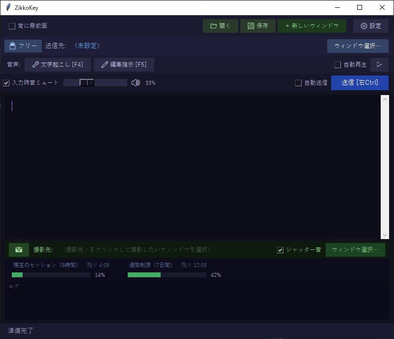
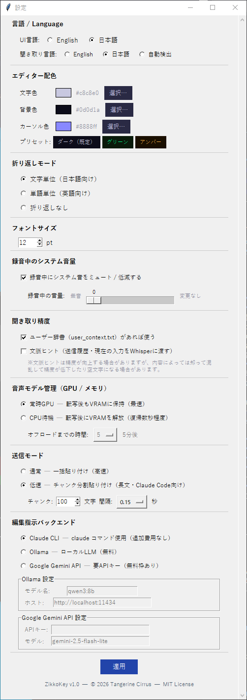

# ZikkoKey
**Enter ≠ Return**。   AIコーディングエージェント向け 音声付き簡易エディター（入力パッド）

ZikkoKey は、Claude Code などの AI コーディングエージェントと一緒に使うための軽量デスクトップ入力パッドです。
声で入力、声で編集も可能。編集した内容は任意のウィンドウへ送信できます。

🤔ああ、またShift+Enterを押すつもりがEnterを押してしまった。未だにたまにやってしまう。  
メインフレームのエディターでは"↵"キーはあくまでも改行で、実行キー（Enterキー）を押して初めてホスト側に送信される。あの操作感で使いたくて、この入力パッドを作った。  
最近は音声入力もかなり使っているので、Whisperも連動させた。  
（なお、汎用ではあるが、現在Claude Codeを主に使っているので、それに寄せています。）



---


## 特徴

- **音声入力** — OpenAI Whisper による文字起こし　※別途Whisperのインストールが必要
- **音声編集** — テキストを音声で編集（改行して/校正して/箇条書きにして/☓☓を〇〇にして/etc うまくいかない時もある（Ctrl+Zで戻す））  
 選べる音声編集AI  —  できるだけ費用をかけない方向  
　Claude Code CLI /現在使用しているClaude CLIをそのまま使う  
　Ollama（Qwen等）/ローカルLLM（無料）　※別途Ollamaのインストールが必要  
　Google Gemini API /無料枠あり　※別途APIキー取得が必要  
　使用頻度にもよるが、今のおすすめはGoogle Gemini API。Claude Codeも消費せずに済み、反応も速い。  
- **画像撮影機能** — 選択したウィンドウの画像を取得する。画像は実行ファイルzikkokey.pyと同じフォルダにファイル名shot.png保存される。Claudeには絶対パスで伝えるの確実（例：c:\zikkokey\shot.png）だが、claudeのCLAUDE.mdに以下のように書いておけば画像を見るように言えば伝わる。
    #### zikkokeyとclaudeが同じフォルダの場合
    \## Screenshot  
`shot.png` in this directory is the screenshot saved by the 📸 button in the app.  
When the user shares this file, review its contents.  

  
  #### zikkokeyとclaudeが別のフォルダの場合、ファイルパスを明記（例:C:\zikkotest\shot.png）  

  \## Screenshot  
  The screenshot taken by the user is saved at C:\zikkotest\shot.png  
  When the user mentions the screenshot or asks you to look at it, read this file.  


- **音声入力時のミュート** — バックで音楽を鳴らしている時などに、音声入力時に一時的にシステムからの音をミュートや音量を絞る
- **入力した音声の再生** — 喋った後に自動的に再生することができる。滑舌チェックのための便利機能。
- **Claude.ai 使用状況ゲージ** — Claude Codeの使用状況を下部に表示　※別途、`rate_limit_bridge.py` のインストールが必要（下記）
- **新規ウィンドウ** — 複数の入力パッドを開く。同時起動よりメモリを消費しない。（またChromeなどWebブラウザに送信する場合は、□自動送信　にチェックするのがおすすめ。実行キーを押さなくとも送信されます。ただ、編集指示はできなくなります）
- **軽量** — メインのコードzikkokey.pyは200kB未満と非常に小さく、シャッター音など不要ならこのファイルだけで動く。このコードをプロジェクトごとのフォルダに移動して使うことも容易。


## 動作環境

- Windows（MacOSはメイン部分は動くと思いますが、音声再生などいくつかMac向けに調整が必要です。わずかな手直しで済むと思いますが現在使えるマックを持っていないので、対応できていません。すみません。Linuxは画像キャプチャ部分などMacより手直しが必要なようです。）


## インストール

### 1. リポジトリをクローン

```bash
git clone https://github.com/YOUR_USERNAME/zikkokey.git
cd zikkokey
```

### 2. Python パッケージのインストール

```bash
pip install -r requirements.txt
```

### 3. Claude code 使用状況ゲージ（オプション）

`rate_limit_bridge.py` をセットアップすると、ZikkoKey に 5h / 7d のレート制限バーが表示されます。
Claude Code が自動でこのスクリプトを呼び出し、使用状況をキャッシュファイルに書き出します。

1. `rate_limit_bridge.py` を `~/.zikkokey/` にコピー

2. `~/.claude/settings.json` に以下を追記：

```json
{
  "statusLine": {
    "type": "command",
    "command": "python \"$HOME/.zikkokey/rate_limit_bridge.py\""
  }
}
```

### 4. Ollama（オプション）

音声編集AIでローカルLLMを使用する場合はインストールが必要。

1. ダウンロード・インストール

   ブラウザで以下を開いてインストーラーをダウンロード：  
   https://ollama.com/download/windows  
   OllamaSetup.exe を実行してインストール。

2. モデルのダウンロード

   インストール後、ターミナル（PowerShell または CMD）でモデルをダウンロード（例：qwen3:8b）：
   ```
   ollama pull qwen3:8b
   ```
   qwen3:8b は約5GB程度なので、回線速度によりますが数分〜十数分かかります。

3. 起動確認

   Ollamaはインストール後タスクトレイに常駐します。ターミナルから以下で確認：
   ```
   ollama list
   ```
   qwen3:8b が一覧に出れば準備完了です。

   補足：ZikkoKeyの設定画面から編集指示バックエンドとしてOllamaを選択し、モデル名にダウンロードしたモデル名を入力してください。
  

---


## 起動

**コマンドラインから：**
```bash
python zikkokey.py
```
コマンドラインからがおすすめ。起動ディレクトリはClaude Codeに信頼させてください。

**Windows — ダブルクリックで起動：**
```
zikkokey.vbs        # コンソールウィンドウなしで起動（通常はこちら）
zikkokey.bat        # コンソールウィンドウありで起動
```

デフォルトは英語メニューなので、日本語にしたい場合は設定で変更してください。


## 使い方

| 操作 | 方法 |
|---|---|
| 音声文字起こし 開始／停止 | **F4** を押している間（または「文字起こし」ボタンを押している間） |
| AI 編集指示 開始／停止 | **F5** を押している間（または「編集指示」ボタンを押している間） |
| テキストを送信先へ送る | **右 Ctrl**（または「送信」ボタン） |
| 送信先ウィンドウを選択 | 「ウィンドウ選択…」をクリック後、対象ウィンドウをクリック |
| 送信先を固定 / 解除 | 「フリー / 固定」ボタン |
| スクリーンショット撮影 | 📸 ボタンをクリック後、対象ウィンドウをクリック |
| 設定を開く | 「設定」ボタン |

### 送信モード

| モード | 動作 |
|---|---|
| 通常（高速） | テキストを一括貼り付け |
| 低速（チャンク分割） | 少量ずつ分割して送信。Claude Code の長文入力向け |

Claude Codeへのペーストが失敗しないよう、低速（チャンク分割）を使用してください。


### ショートカット

独自実装（このアプリ固有）

| ショートカット | 動作 |
|---|---|
| Ctrl + Z | 元に戻す（テキストが空になると送信履歴からも復元） |
| Ctrl + Y | やり直し（Ctrl+Z で戻した履歴を再展開） |
| Ctrl + S | テキストをファイルに保存（保存ダイアログ） |
| Ctrl + O | ファイルを読み込む（開くダイアログ） |
| 右Ctrl | 送信（送信先ウィンドウへ） |
| ↑ / ↓（空欄時） | 送信先ウィンドウへ矢印キーを転送 |
| ↑ / ↓（入力中） | 通常のカーソル移動 |


  

Tkinter Text ウィジェット標準

| ショートカット | 動作 |
|---|---|
| Ctrl + A | 全選択 |
| Ctrl + C | コピー |
| Ctrl + X | 切り取り |
| Ctrl + V | 貼り付け |
| Home | 行頭 |
| End | 行末 |
| Ctrl + Home | 文章先頭 |
| Ctrl + End | 文章末尾 |
| Shift + ←/→ | 文字単位選択 |
| Shift + Home/End | 行頭・行末まで選択 |
| Ctrl + Shift + Home/End | 文章先頭・末尾まで選択 |
| Delete | カーソル右の1文字削除 |
| BackSpace | カーソル左の1文字削除 |

---

注意点：
- Ctrl + Z / Ctrl + Y は独自実装で上書きされているため、Tkinter標準の undo/redo とは挙動が異なります（送信履歴との連携あり）
- Ctrl + A は標準では「行頭移動」ですが、Windowsの Tkinter では全選択として動作することが多いです


---
### 設定画面
 


## 謝辞

ZikkoKey は、 [OpenAI Whisper](https://github.com/openai/whisper) はじめ世界中のオープンソースの成果の上に成り立っています。開発者の皆さんに、心より感謝いたします。


## ライセンス

ZikkoKey v1.0 — © 2026 Tangerine Cirrus — [MIT License](LICENSE)
