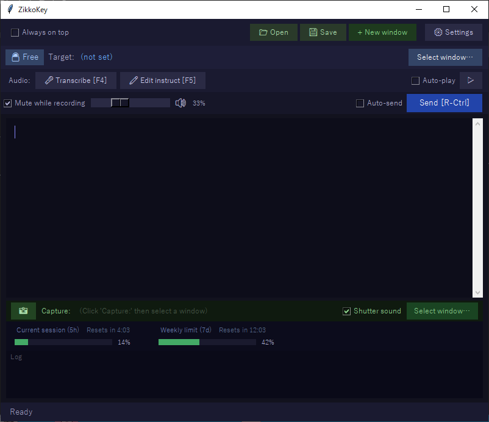
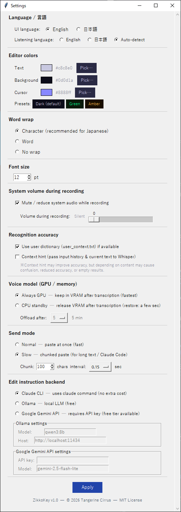

(English / [日本語](#japanese))

# ZikkoKey
**Enter ≠ Return** — Voice-enabled input pad for AI coding agents

ZikkoKey is a lightweight desktop input pad designed to be used alongside AI coding agents like Claude Code.
Voice input and voice-based editing are both supported. Edited text can be sent to any window.

🤔 Ugh, I pressed Enter again when I meant to press Shift+Enter. Still happens sometimes.  
On mainframe editors, the "↵" key is purely a line break — you only send to the host by pressing the Execute key (Enter). I wanted that same feel, so I built this input pad.  
Lately I've been using voice input quite a bit too, so I wired in Whisper as well.  
(This app is general-purpose, but since I mainly use Claude Code right now, it's tuned toward that.)



---

## Features

- **Voice transcription** — Transcribes speech via OpenAI Whisper ※ Whisper setup is required. It is included in step 2: Python package installation (requirements.txt).
- **Voice editing** — Edit text by voice (add a line break / proofread / make it a list / change X to Y / etc. — doesn't always work perfectly; use Ctrl+Z to undo). Choose from three AI backends: Claude Code CLI, Ollama, or Google Gemini API (see Optional Settings for details).
- **Screenshot capture** — Captures the selected window and saves it as `shot.png` in the same folder as `zikkokey.py`. For how to configure Claude to use this image, see Optional Settings.
- **Mute during voice input** — Temporarily mutes or lowers system audio while recording, useful when background music is playing
- **Playback of recorded audio** — Automatically plays back your recording after speaking. Handy for checking your own articulation.
- **Claude.ai usage gauge** — Displays Claude Code usage at the bottom ※ Requires `rate_limit_bridge.py` to be set up (see Optional Settings)
- **New window** — Opens additional input pads. Uses less memory than running multiple instances simultaneously. (When sending to a web browser like Chrome, enabling ☑ Auto-send is recommended — text is sent without pressing the Execute key. Note: voice editing will be unavailable in this mode.)
- **Lightweight** — The main script `zikkokey.py` is under 200 KB. If you don't need the shutter sound, this single file is all you need. Easy to copy into any project folder and use from there.

---

## System Requirements

- Windows (GPU recommended. The Whisper voice input component can run on CPU only, but may be very slow depending on your hardware.)
  macOS should mostly work for the core features, but some parts like audio playback need Mac-specific adjustments. Since I don't currently have a Mac available, it hasn't been tested. Linux requires more changes than macOS, particularly around screen capture.

---

## Installation

### 1. Clone the repository

```bash
git clone https://github.com/Eiji-Kb/ZikkoKey.git
cd ZikkoKey
```

### 2. Install Python packages

```bash
pip install -r requirements.txt
```

---

## Launching

**From the command line:**
```bash
python zikkokey.py
```
Launching from the command line is recommended. Make sure to trust the launch directory in Claude Code.

**Windows — double-click to launch:**
```
zikkokey.vbs        # Launches without a console window (recommended)
zikkokey.bat        # Launches with a console window
```

The default UI language is English. To switch to Japanese, change it in the settings.

---

## Optional Settings

### Claude Code Usage Gauge

Setting up `rate_limit_bridge.py` enables the 5h / 7d rate limit bars in ZikkoKey.
Claude Code automatically calls this script and writes usage data to a cache file.

1. Copy `rate_limit_bridge.py` to `~/.zikkokey/`

2. Add the following to `~/.claude/settings.json`:

```json
{
  "statusLine": {
    "type": "command",
    "command": "python \"$HOME/.zikkokey/rate_limit_bridge.py\""
  }
}
```

If your existing `settings.json` already has other settings, merge them as shown below. A JSON file can only have one root object.

```json
{
  "autoUpdatesChannel": "latest",
  "statusLine": {
    "type": "command",
    "command": "python \"$HOME/.zikkokey/rate_limit_bridge.py\""
  }
}
```

> If you're not confident editing JSON manually, explaining what needs to be added and asking Claude Code to do it may be faster and more reliable.

### CLAUDE.md Configuration (Screenshot Capture)

Specifying the absolute path (e.g. `c:\zikkokey\shot.png`) to Claude is most reliable, but you can also add the following to `CLAUDE.md` so Claude understands when you say "look at the screenshot":

#### When zikkokey and Claude are in the same folder

\## Screenshot  
`shot.png` in this directory is the screenshot saved by the 📸 button in the app.  
When the user mentions the screenshot or asks you to look at it, read this file.

#### When zikkokey and Claude are in different folders (specify the file path)

\## Screenshot  
The screenshot taken by the user is saved at C:\zikkotest\shot.png  
When the user mentions the screenshot or asks you to look at it, read this file.

### Settings



### Ollama

Required if you want to use a local LLM for voice editing.

1. Download and install

   Open the following URL in your browser to download the installer:  
   https://ollama.com/download/windows  
   Run OllamaSetup.exe to install.

2. Download a model

   After installation, download a model in a terminal (PowerShell or CMD), e.g.:
   ```
   ollama pull qwen3:8b
   ```
   qwen3:8b is approximately 5 GB, so it may take a few to several minutes depending on your connection speed.

3. Verify the installation

   Ollama runs in the system tray after installation. You can also verify from a terminal:
   ```
   ollama list
   ```
   If qwen3:8b appears in the list, you're ready to go.

   Note: In ZikkoKey's settings, select Ollama as the voice-editing backend and enter the downloaded model name.

### Google Gemini API

Obtain an API key from [Google AI Studio](https://aistudio.google.com). If you are already logged in, you can get one via "Get API key" at the bottom of the left menu. The project name can be anything. Enter the API key and model name (e.g., gemini-2.5-flash-lite) in ZikkoKey's settings.

---

## How to Use

| Action | Method |
|---|---|
| Start / stop voice transcription | Hold **F4** (or hold the "Transcribe" button) |
| Start / stop AI voice editing | Hold **F5** (or hold the "Edit" button) |
| Send text to target window | **Right Ctrl** (or the "Send" button) |
| Select target window | Click "Select Window…", then click the target window |
| Lock / unlock target window | "Free / Lock" button |
| Take a screenshot | Click the 📸 button, then click the target window |
| Open settings | "Settings" button |

### Send Mode

| Mode | Behavior |
|---|---|
| Normal (fast) | Pastes all text at once |
| Slow (chunked) | Sends in small chunks. Recommended for long input to Claude Code |

Use Slow (chunked) mode to avoid paste failures when sending to Claude Code.

### Shortcuts

App-specific (custom implementation)

| Shortcut | Action |
|---|---|
| Ctrl + Z | Undo (also restores from send history when the text area is empty) |
| Ctrl + Y | Redo (re-applies history reversed by Ctrl+Z) |
| Ctrl + S | Save text to file (save dialog) |
| Ctrl + O | Load text from file (open dialog) |
| Right Ctrl | Send to target window |
| ↑ / ↓ (when empty) | Forward arrow keys to target window |
| ↑ / ↓ (while typing) | Normal cursor movement |

Tkinter Text widget standard

| Shortcut | Action |
|---|---|
| Ctrl + A | Select all |
| Ctrl + C | Copy |
| Ctrl + X | Cut |
| Ctrl + V | Paste |
| Home | Go to line start |
| End | Go to line end |
| Ctrl + Home | Go to document start |
| Ctrl + End | Go to document end |
| Shift + ←/→ | Select character by character |
| Shift + Home/End | Select to line start/end |
| Ctrl + Shift + Home/End | Select to document start/end |
| Delete | Delete character to the right of cursor |
| BackSpace | Delete character to the left of cursor |

---

Notes:
- Ctrl + Z / Ctrl + Y use a custom implementation that overrides Tkinter's default undo/redo — behavior differs due to integration with send history

---

## Acknowledgements

ZikkoKey stands on the shoulders of open-source work from around the world, starting with [OpenAI Whisper](https://github.com/openai/whisper). Heartfelt thanks to all the developers who share their work so generously.

## License

ZikkoKey v1.0 — © 2026 Tangerine Cirrus — [MIT License](LICENSE)

---

<a id="japanese"></a>

# ZikkoKey
**Enter ≠ Return**。   AIコーディングエージェント向け 音声付き簡易エディター（入力パッド）

ZikkoKey は、Claude Code などの AI コーディングエージェントと一緒に使うための軽量デスクトップ入力パッドです。
声で入力、声で編集も可能。編集した内容は任意のウィンドウへ送信できます。

🤔ああ、またShift+Enterを押すつもりがEnterを押してしまった。未だにたまにやってしまう。  
メインフレームのエディターでは"↵"キーはあくまでも改行で、実行キー（Enterキー）を押して初めてホスト側に送信される。あの操作感で使いたくて、この入力パッドを作った。  
最近は音声入力もかなり使っているので、Whisperも連動させた。  
（なおこのアプリは汎用ではあるが、現在Claude Codeを主に使っているので、それに寄せています。）


---

## 特徴

- **音声入力** — OpenAI Whisper による文字起こし　※Whisperの導入が必要。2. Python パッケージのインストール（requirements.txt）に含んでいます。
- **音声編集** — テキストを音声で編集（改行して/校正して/箇条書きにして/☓☓を〇〇にして/etc うまくいかない時もある（Ctrl+Zで戻す））。Claude Code CLI・Ollama・Google Gemini API の3種類から選択可能（詳細はオプション設定参照）
- **画像撮影機能** — 選択したウィンドウの画像を取得し、zikkokey.pyと同じフォルダにshot.pngとして保存。Claudeへの伝え方はオプション設定参照。
- **音声入力時のミュート** — バックで音楽を鳴らしている時などに、音声入力時に一時的にシステムからの音をミュートや音量を絞る
- **入力した音声の再生** — 喋った後に自動的に再生することができる。滑舌チェックのための便利機能。
- **Claude.ai 使用状況ゲージ** — Claude Codeの使用状況を下部に表示　※別途、`rate_limit_bridge.py` のセットアップが必要（オプション設定参照）
- **新規ウィンドウ** — 複数の入力パッドを開く。同時起動よりメモリを消費しない。（またChromeなどWebブラウザに送信する場合は、□自動送信　にチェックするのがおすすめ。実行キーを押さなくとも送信されます。ただ、編集指示はできなくなります）
- **軽量** — メインのコードzikkokey.pyは200kB未満と非常に小さく、シャッター音など不要ならこのファイルだけで動く。このコードをプロジェクトごとのフォルダに移動して使うことも容易。

---

## 動作環境

- Windows（GPU推奨。音声入力部分のWhisperはCPUのみでも動きますが、機種によっては非常に遅くなります。）
  macOSはメイン部分は動くと思いますが、音声再生などいくつかMac向けに調整が必要です。わずかな手直しで済むと思いますが、現在使えるマックを持っていないため対応できていません。すみません。Linuxは画像キャプチャ部分などMacより手直しが必要なようです。

---

## インストール

### 1. リポジトリをクローン

```bash
git clone https://github.com/Eiji-Kb/ZikkoKey.git
cd ZikkoKey
```

### 2. Python パッケージのインストール

```bash
pip install -r requirements.txt
```

---

## 起動

**コマンドラインから：**
```bash
python zikkokey.py
```
コマンドラインからがおすすめ。起動ディレクトリはClaude Codeに信頼させてください。

**Windows — ダブルクリックで起動：**
```
zikkokey.vbs        # コンソールウィンドウなしで起動（通常はこちら）
zikkokey.bat        # コンソールウィンドウありで起動
```

デフォルトは英語メニューなので、日本語にしたい場合は設定で変更してください。

---

## オプション設定

### Claude Code 使用状況ゲージ

`rate_limit_bridge.py` をセットアップすると、ZikkoKey に 5h / 7d のレート制限バーが表示されます。
Claude Code が自動でこのスクリプトを呼び出し、使用状況をキャッシュファイルに書き出します。

1. `rate_limit_bridge.py` を `~/.zikkokey/` にコピー

2. `~/.claude/settings.json` に以下を追記：

```json
{
  "statusLine": {
    "type": "command",
    "command": "python \"$HOME/.zikkokey/rate_limit_bridge.py\""
  }
}
```

既存の `settings.json` に他の設定がある場合は、以下のようにマージしてください。JSONファイルはルートオブジェクトを1つしか持てません。

```json
{
  "autoUpdatesChannel": "latest",
  "statusLine": {
    "type": "command",
    "command": "python \"$HOME/.zikkokey/rate_limit_bridge.py\""
  }
}
```

> 手動での編集に自信がない場合は、Claude Codeに追記内容を説明して依頼する方が確実で早いかもしれません。

### CLAUDE.mdの設定例（画像撮影機能）

撮影した画像をClaude に伝える際、絶対パス（例：`c:\zikkokey\shot.png`）で指定するのが確実ですが、CLAUDE.mdに以下のように書いておけば「画像を見て」と言えば伝わります。

#### zikkokeyとclaudeが同じフォルダの場合

\## Screenshot  
`shot.png` in this directory is the screenshot saved by the 📸 button in the app.  
When the user mentions the screenshot or asks you to look at it, read this file.

#### zikkokeyとclaudeが別のフォルダの場合（ファイルパスを明記）

\## Screenshot  
The screenshot taken by the user is saved at C:\zikkotest\shot.png  
When the user mentions the screenshot or asks you to look at it, read this file.

### 設定画面


### Ollama

音声編集AIでローカルLLMを使用する場合はインストールが必要。

1. ダウンロード・インストール

   ブラウザで以下を開いてインストーラーをダウンロード：  
   https://ollama.com/download/windows  
   OllamaSetup.exe を実行してインストール。

2. モデルのダウンロード

   インストール後、ターミナル（PowerShell または CMD）でモデルをダウンロード（例：qwen3:8b）：
   ```
   ollama pull qwen3:8b
   ```
   qwen3:8b は約5GB程度なので、回線速度によりますが数分〜十数分かかります。

3. 起動確認

   Ollamaはインストール後タスクトレイに常駐します。ターミナルから以下で確認：
   ```
   ollama list
   ```
   qwen3:8b が一覧に出れば準備完了です。

   補足：ZikkoKeyの設定画面から編集指示バックエンドとしてOllamaを選択し、モデル名にダウンロードしたモデル名を入力してください。

### Google Gemini API

[Google AI Studio](https://aistudio.google.com) からAPIキーを取得してください。ログインユーザの場合、左メニュー下部の「Get API key」から取得できます。プロジェクト名は任意で構いません。取得したAPIキーとモデル名（例：gemini-2.5-flash-lite）を ZikkoKey の設定画面に入力してください。

---

## 使い方

| 操作 | 方法 |
|---|---|
| 音声文字起こし 開始／停止 | **F4** を押している間（または「文字起こし」ボタンを押している間） |
| AI 編集指示 開始／停止 | **F5** を押している間（または「編集指示」ボタンを押している間） |
| テキストを送信先へ送る | **右 Ctrl**（または「送信」ボタン） |
| 送信先ウィンドウを選択 | 「ウィンドウ選択…」をクリック後、対象ウィンドウをクリック |
| 送信先を固定 / 解除 | 「フリー / 固定」ボタン |
| スクリーンショット撮影 | 📸 ボタンをクリック後、対象ウィンドウをクリック |
| 設定を開く | 「設定」ボタン |

### 送信モード

| モード | 動作 |
|---|---|
| 通常（高速） | テキストを一括貼り付け |
| 低速（チャンク分割） | 少量ずつ分割して送信。Claude Code の長文入力向け |

Claude Codeへのペーストが失敗しないよう、低速（チャンク分割）を使用してください。

### ショートカット

独自実装（このアプリ固有）

| ショートカット | 動作 |
|---|---|
| Ctrl + Z | 元に戻す（テキストが空になると送信履歴からも復元） |
| Ctrl + Y | やり直し（Ctrl+Z で戻した履歴を再展開） |
| Ctrl + S | テキストをファイルに保存（保存ダイアログ） |
| Ctrl + O | ファイルを読み込む（開くダイアログ） |
| 右Ctrl | 送信（送信先ウィンドウへ） |
| ↑ / ↓（空欄時） | 送信先ウィンドウへ矢印キーを転送 |
| ↑ / ↓（入力中） | 通常のカーソル移動 |

Tkinter Text ウィジェット標準

| ショートカット | 動作 |
|---|---|
| Ctrl + A | 全選択 |
| Ctrl + C | コピー |
| Ctrl + X | 切り取り |
| Ctrl + V | 貼り付け |
| Home | 行頭 |
| End | 行末 |
| Ctrl + Home | 文章先頭 |
| Ctrl + End | 文章末尾 |
| Shift + ←/→ | 文字単位選択 |
| Shift + Home/End | 行頭・行末まで選択 |
| Ctrl + Shift + Home/End | 文章先頭・末尾まで選択 |
| Delete | カーソル右の1文字削除 |
| BackSpace | カーソル左の1文字削除 |

---

注意点：
- Ctrl + Z / Ctrl + Y は独自実装で上書きされているため、Tkinter標準の undo/redo とは挙動が異なります（送信履歴との連携あり）

---

## 謝辞

ZikkoKey は、 [OpenAI Whisper](https://github.com/openai/whisper) はじめ世界中のオープンソースの成果の上に成り立っています。開発者の皆さんに、心より感謝いたします。

## ライセンス

ZikkoKey v1.0 — © 2026 Tangerine Cirrus — [MIT License](LICENSE)
